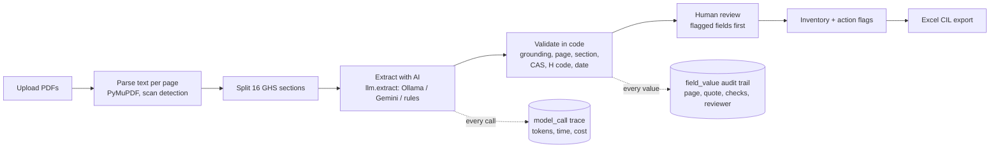

# ChemReady

[](https://github.com/alqurayish/chemready/actions/workflows/ci.yml)

**AI that turns chemical safety data sheets into a verified, audit ready chemical inventory. Every value is traced to its source page.**

*ChemReady Prototype · A D-SAi Product · by Md. Alqurayish Sharkar, AI Product Engineer*

> **Status: Discovery and working MVP.** The full pipeline (upload, PDF parsing, AI
> extraction, validation, human review, inventory, action flags and Excel export) is
> built and tested on fictional files. Real accuracy numbers wait for the hand-labelled
> gold set of public SDS files and customer interviews. Nothing in this repository
> claims accuracy on real data yet.


---

## The problem

Wet processing facilities that supply global fashion brands use roughly 170 to 200
chemical products each. Every product should have a safety data sheet (SDS), and brands
expect a monthly chemical inventory screened against the ZDHC Manufacturing Restricted
Substances List (MRSL). A 2023 study of six Bangladesh facilities found that 28% to 48%
of chemicals were still "not evaluated". Building the inventory from PDF safety data
sheets is slow, manual work, and mistakes are risky.

## What ChemReady does

1. **Upload** up to 50 SDS PDFs at once. Non-PDFs and duplicates are rejected with a reason.
2. **Extract** product, supplier, revision date, signal word, H codes, pictograms,
   ingredients with CAS numbers, PPE and storage. Every value carries its page and exact quote.
3. **Validate** in plain code: the quote must be in the PDF and in the right section,
   CAS numbers must pass the check digit, H codes must be well formed.
4. **Review**: a person sees doubtful fields first, next to the highlighted source, and
   approves, edits or marks them missing. Nothing enters the inventory without approval.
5. **Act and export**: action flags (old SDS, missing CAS, missing sections, unreadable
   files) and an Excel chemical inventory list.

**Principles:** the AI never guesses (unsure means "not found" and human review). Private
factory files never go to a free AI tier. ChemReady never claims a chemical is MRSL
conformant; only the ZDHC Gateway and the factory's solution provider decide that.

## Architecture



The AI does one job: reading messy PDFs into a fixed schema. Plain code checks every
value, a person approves what is doubtful, and the database keeps the source of every
value so any auditor can trace it.

| Layer | Code |
| --- | --- |
| PDF parsing and sections | [`src/chemready/pdf/`](src/chemready/pdf/) |
| Schema (value + page + quote) | [`src/chemready/schema.py`](src/chemready/schema.py) |
| Model layer and prompt | [`src/chemready/extraction/`](src/chemready/extraction/) |
| Validation | [`src/chemready/validation/`](src/chemready/validation/) |
| Evals | [`src/chemready/evals/`](src/chemready/evals/), [`evals/`](evals/) |
| Database, API, background worker | [`src/chemready/app/`](src/chemready/app/) |
| Pages (Jinja2) | [`src/chemready/app/templates/`](src/chemready/app/templates/) |

## Eval results

| Run | Data | Field accuracy | H code + CAS recall | Hallucination rate | Notes |
| --- | --- | --- | --- | --- | --- |
| Pipeline check | 4 fictional SDS, rules baseline | 100% | 100% | 0% | Software test only. Tidy fictional files; says nothing about real SDS. Runs in CI on every push. |
| v1 (AI) | 30 real public SDS | – | – | – | **Not run yet.** Needs the gold set ([how to collect it](docs/data/collecting-sds.md)). |

Targets (PRD): field accuracy ≥ 95%, H code and CAS recall ≥ 95%, 0% hallucinations,
calibration ≥ 98%, 10% to 25% of fields sent to review, under 30 s per SDS. Real runs are
logged in [`evals/results.md`](evals/results.md).

## Try it

### Demo on your computer (no AI account needed)

```bash
git clone https://github.com/alqurayish/chemready.git && cd chemready
uv sync                                   # install (needs uv: docs.astral.sh/uv)
uv run chemready seed-demo                # demo account with fictional SDS files
CHEMREADY_LLM_PROVIDER=rules uv run chemready serve
```

Open http://127.0.0.1:8000 and click **Try the demo** (`demo@chemready.app` / `demo1234`).

### With Docker

```bash
docker build -t chemready .
docker run -p 7860:7860 -e CHEMREADY_DEMO=true -e CHEMREADY_LLM_PROVIDER=rules \
  -e CHEMREADY_SECRET_KEY="$(python3 -c 'import secrets; print(secrets.token_urlsafe(48))')" chemready
```

Public demo on Hugging Face Spaces: see [docs/deploy.md](docs/deploy.md).

### With a real model

Copy `.env.example` to `.env`, then either:

- **Ollama (local, private files allowed):** install Ollama, `ollama pull <model>`, set
  `CHEMREADY_LLM_PROVIDER=ollama` and `CHEMREADY_OLLAMA_MODEL=<model>`.
- **Gemini (public SDS only on the free tier):** set `CHEMREADY_LLM_PROVIDER=gemini`,
  `CHEMREADY_GEMINI_API_KEY` and `CHEMREADY_GEMINI_MODEL` (pick a current free-tier model
  from Google's pricing page).

## Development

| Task | Command |
| --- | --- |
| Tests with coverage (≥ 90% required) | `uv run pytest --cov` |
| Lint and format | `uv run ruff check` · `uv run ruff format` |
| Type check (strict) | `uv run mypy` |
| Pipeline eval on fictional files | see [evals/README.md](evals/README.md) |

CI runs lint, format, types, tests, the eval gate and a Docker build on every push.

## Documentation

| Topic | Link |
| --- | --- |
| Product requirements (PRD) | Private document; summary above |
| Design: flows, screens, design system, prototype, usability test | [docs/design/](docs/design/), [prototype/](prototype/) |
| Collecting and labelling SDS files | [docs/data/](docs/data/) |
| Extraction, backend, frontend, observability | [docs/engineering/](docs/engineering/) |
| Deploy | [docs/deploy.md](docs/deploy.md) |
| Why it is built this way | [DECISIONS.md](DECISIONS.md) |
| Demo recording script | [docs/demo-gif-script.md](docs/demo-gif-script.md) |

## Roadmap

- [x] Product design: user flow, screen specs, design system, clickable prototype, usability test plan
- [x] Code foundation: uv, typed config with a privacy rule, lint, strict types, tests, CI
- [x] Eval tooling: gold format, labelling guide, gold checker, run_evals with calibration and review rate
- [x] PDF parsing, scan detection and GHS section splitting
- [x] Extraction engine: one model interface, Ollama, Gemini, rules baseline, injection defence
- [x] Validation: grounding, page, section, CAS, H code and date checks, review flags
- [x] Backend, review screen, inventory, action flags and Excel export
- [x] Tracing, cost tracking, JSON logs, CI eval gate, Docker
- [ ] Customer discovery: 10 interviews with chemical and compliance managers
- [ ] Gold set of 30 labelled public SDS files, then v1, v2, v3 eval results
- [ ] OCR for scanned SDS files, the pilot's CIL template, email for password resets
- [ ] Pilot with 2 facilities (private deployment with Ollama)

## Are you a chemical or compliance manager?

I would like to learn how you prepare your chemical inventory today. Reach me on
[LinkedIn](https://www.linkedin.com/in/alqurayishsharkar/) or at alqurayish@gmail.com.

## Author

**Md. Alqurayish Sharkar**, AI Product Engineer and Founder of [D-SAi](https://d-sai.com).
ChemReady is a D-SAi product.

## Sources

- [Process wise ZDHC MRSL conformance status of the Bangladesh RMG sector](https://rsisinternational.org/journals/ijriss/articles/evaluation-of-process-wise-zdhc-mrsl-conformance-status-of-bangladesh-rmg-sector/), IJRISS, 2023
- [ZDHC MRSL](https://www.roadmaptozero.com/mrsl)
- [About InCheck: FAQ for suppliers](https://knowledge-base.roadmaptozero.com/hc/en-gb/articles/38172043364765-About-InCheck-Frequently-Asked-Questions-Suppliers)

## License

MIT
