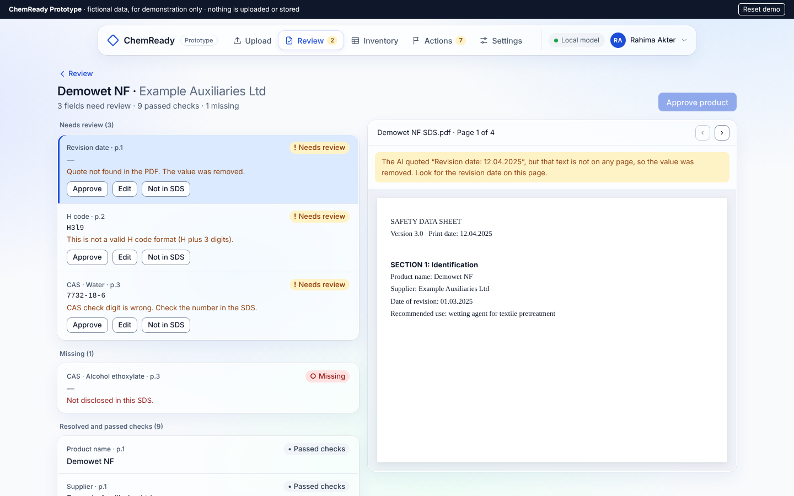

# ChemReady

[](https://github.com/alqurayish/chemready/actions/workflows/ci.yml)

**AI that turns chemical safety data sheets into a verified, audit ready chemical inventory. Every value is traced to its source page.**

*ChemReady Prototype · A D-SAi Product*

> **Status: Discovery.** I am interviewing chemical and compliance managers at Bangladesh dyeing, washing and printing facilities. The design is done and the code foundation is in place; no AI extraction is built yet. This repository is built in public. Progress, eval results and decisions are published here as they happen.



---

## The problem

Wet processing facilities that supply global fashion brands use roughly 170 to 200 chemical products each. Every product should have a safety data sheet (SDS), and brands expect a monthly chemical inventory screened against the ZDHC Manufacturing Restricted Substances List (MRSL).

A 2023 study of six Bangladesh facilities found that 28% to 48% of chemicals were still "not evaluated" against the MRSL. Building and maintaining the inventory from PDF safety data sheets is slow, manual work, and mistakes are risky.

## What ChemReady will do

1. **Upload** a batch of supplier SDS PDFs.
2. **Extract** key fields with an LLM: product, supplier, revision date, hazard codes, pictograms, ingredients with CAS numbers, PPE and storage. Every value carries its page number and exact quote.
3. **Validate** with plain code, not AI: the quote must exist in the PDF, CAS numbers must pass the check digit, hazard codes must be well formed.
4. **Review**: a person approves or edits only the doubtful fields.
5. **Export** an audit ready chemical inventory in Excel, with missing and outdated data flagged.

**Principle:** if the AI is not sure, it says "not found" and sends the field to human review. It never guesses. ChemReady never claims a chemical is MRSL conformant; only the official tools decide that.

## Design and prototype

A clickable HTML prototype of every P0 screen, with fictional sample data, is in [`prototype/`](prototype/). Open `prototype/index.html` in a browser (no install needed). Demo login: `demo@chemready.app` / `demo1234`.

| Document | What it covers |
| --- | --- |
| [01 Tasks, screens and flow](docs/design/01-tasks-screens-flow.md) | User tasks and the P0 screens |
| [02 Screen specs](docs/design/02-screen-specs.md) | Layout, states and copy for each screen |
| [03 Design system](docs/design/03-design-system.md) | Colours, type, spacing, status styles ([tokens](docs/design/tokens.css)) |
| [04 Navigation and sign in](docs/design/04-navigation-and-sign-in.md) | Top navigation, progressive sign in, security requirements |
| [05 Usability test](docs/design/05-usability-test.md) | Five tasks to test the prototype with chemical managers |

## Architecture (planned)

```
PDF upload
  -> Parse text per page (PyMuPDF; scans go to OCR)
  -> Split into the 16 GHS sections
  -> Extract with LLM into a Pydantic schema (value + page + quote)
  -> Validate in code (grounding, CAS checksum, H code format)
  -> Human review of flagged fields
  -> Chemical inventory (SQLite) -> Excel export
```

## Getting started (developers)

Requires [uv](https://docs.astral.sh/uv/getting-started/installation/) (free). uv installs Python 3.12 for you if it is missing.

```bash
git clone https://github.com/alqurayish/chemready.git
cd chemready
uv sync                  # create .venv and install everything from uv.lock
cp .env.example .env     # your local settings; .env is never committed
uv run chemready         # prints the version and a safe settings summary
```

### Everyday commands

| Task | Command |
| --- | --- |
| Run the tests with coverage | `uv run pytest --cov` |
| Lint | `uv run ruff check` (add `--fix` to fix safe issues) |
| Format | `uv run ruff format` |
| Type check | `uv run mypy` |

GitHub Actions runs all four on every push and pull request ([`.github/workflows/ci.yml`](.github/workflows/ci.yml)). Coverage below 90% fails the build.

### Configuration and privacy

All settings come from environment variables with the prefix `CHEMREADY_`, or from a local `.env` file. See [`.env.example`](.env.example).

- The default model provider is **Ollama**, which runs locally, so private factory files stay on your machine.
- **Gemini** needs `CHEMREADY_GEMINI_API_KEY` and `CHEMREADY_GEMINI_MODEL`. While `CHEMREADY_GEMINI_FREE_TIER=true`, ChemReady treats Gemini as **public SDS files only**, because Google's free tier may use submitted content to improve its products.
- Secrets are stored as `SecretStr` and never printed. `data/private/` and `.env` are git ignored.

### Project layout

```
src/chemready/   application code (config and command line today)
tests/           pytest tests
docs/design/     product design documents
prototype/       clickable HTML prototype
```

## Planned stack

Python, FastAPI, Pydantic, PyMuPDF, SQLite, Gemini API (public files only) or a local model via Ollama (private files), sentence-transformers for search, GitHub Actions for CI.

## How quality will be measured

| Metric | Target |
| --- | --- |
| Critical field accuracy | 95% or higher |
| Invented values on critical fields | 0 |
| Saved values traced to a source quote | 100% |
| Time to prepare a monthly inventory | 70% less than today |

Results will be measured on a hand labelled gold set of 30 safety data sheets and published in `evals/results.md`.

## Roadmap

- [x] Product design: user flow, screen specs, design system and clickable prototype
- [x] Code foundation: project setup, typed config with a privacy rule, lint, type checks, tests and CI
- [ ] Customer discovery: 10 interviews with chemical and compliance managers
- [ ] Gold set of 30 labelled safety data sheets and an eval script
- [ ] PDF parsing and section splitting
- [ ] Extraction engine with validation
- [ ] Backend, review screen, inventory and Excel export
- [ ] Pilot with 2 facilities
- [ ] Public demo

## Are you a chemical or compliance manager?

I would like to learn how you prepare your chemical inventory today. Reach me on [LinkedIn](https://www.linkedin.com/in/alqurayishsharkar/) or at alqurayish@gmail.com.

## Author

**Md. Alqurayish Sharkar**, AI Product Engineer and Founder of [D-SAi](https://d-sai.com). ChemReady is a D-SAi product.

## Sources

- [Process wise ZDHC MRSL conformance status of the Bangladesh RMG sector](https://rsisinternational.org/journals/ijriss/articles/evaluation-of-process-wise-zdhc-mrsl-conformance-status-of-bangladesh-rmg-sector/), IJRISS, 2023
- [ZDHC MRSL](https://www.roadmaptozero.com/mrsl)
- [About InCheck: FAQ for suppliers](https://knowledge-base.roadmaptozero.com/hc/en-gb/articles/38172043364765-About-InCheck-Frequently-Asked-Questions-Suppliers)

## License

MIT
