# Phase 1, Step 1: User tasks, P0 screens and user flow

Source: ChemReady PRD (Oct 9, 2026), requirements R1 to R7 (P0 only).

## Who we design for

The chemical or compliance manager at a Bangladesh wet processing facility.
Busy, works on a laptop, answers to brand auditors, and must submit a monthly
chemical inventory list (CIL). They will only use ChemReady if it is faster
than typing from PDFs **and** they can prove every value to an auditor.

## Main user tasks (P0)

| # | Task (in the user's words) | PRD req | How often |
|---|---|---|---|
| T1 | "Upload the SDS files I received" | R1 | Weekly / when new chemicals arrive |
| T2 | "Check that my files are being read" | R1 | Each upload |
| T3 | "Fix only the values the system is unsure about" | R2, R3, R4 | Each upload |
| T4 | "Find a chemical in my inventory and see where each value came from" | R5, R2 | Daily, and during audits |
| T5 | "See what I must chase or fix" | R6 | Weekly, before the monthly report |
| T6 | "Export this month's CIL for my solution provider" | R7 | Monthly |
| T7 | "Set my facility rules once" (SDS max age, export template) | R6, R7 | Once at setup |

## P0 screens

| # | Screen | Tasks | What it is for |
|---|---|---|---|
| S1 | **Upload** | T1 | Drop up to 50 PDFs. Non PDFs and duplicates are rejected with a clear reason. Shows where files are processed (public AI tier or local model). |
| S2 | **Documents** (review queue) | T2, T3 | Every uploaded SDS with its status and progress: queued, extracting, needs review, approved, failed. The "to do" list for review. |
| S3 | **Review SDS** | T3 | Split view: extracted fields on the left, the source PDF page with the quote highlighted on the right. Flagged fields first. Approve, edit, or mark "not in SDS" in one click. |
| S4 | **Inventory** | T4 | One table of approved products. Search, filter by supplier, hazard (H code / pictogram) and status. |
| S5 | **Product record** | T4 | Read only audit trail of one product: every value with page, quote, check result, who approved it and when. Reuses the S3 layout. |
| S6 | **Needs action** | T5 | Action flags: SDS older than the set age, missing CAS numbers, missing sections, unreadable files. Each row links to the fix. |
| S7 | **Export CIL** (dialog) | T6 | Pick month and template, see warnings (unreviewed files, open flags), download Excel. |
| S8 | **Settings** | T7 | Facility name, solution provider export template, SDS max age (default 3 years), processing mode. |

Navigation: a left sidebar with Upload, Documents (count to review),
Inventory, Needs action (count), Settings. The counts act as the dashboard,
so there is no separate home screen in P0 (trends are R11, P2).

## User flow

```mermaid
flowchart TD
    A[S1 Upload PDFs] -->|non PDF or duplicate| A1[Rejected with reason]
    A --> B[S2 Documents: per file progress]
    B -->|parse + extract + validate| C{Result}
    C -->|unreadable / failed| F[S6 Needs action: unreadable file]
    C -->|fields extracted| D[S3 Review SDS: flagged fields first]
    D -->|approve / edit / mark not in SDS| E[Approve product]
    E --> G[S4 Inventory]
    G --> H[S5 Product record: page + quote per value]
    G --> I[S6 Needs action: old SDS, missing CAS, missing sections]
    I -->|upload newer SDS| A
    G --> J[S7 Export CIL to Excel]
    J -->|warns if open reviews or flags| D
```

## Design rules that come from the PRD

1. **Nothing enters the inventory without a person.** Even an SDS with zero
   flags needs one "Approve product" click. Flagged fields must each be
   resolved before that button is enabled.
2. **Never show "conformant".** P0 has no MRSL column at all (MRSL matching is
   R9, P1). Our statuses describe *data quality*, not regulatory status:
   Verified, Needs review, Missing.
3. **Every value is traceable.** Anywhere a value is shown, the page and quote
   are one click away.
4. **The AI never guesses.** Low confidence, failed checks or empty hazard
   sections always show as "Needs review", never as a filled value.
5. **Privacy is visible.** The upload screen states whether files go to the
   public free tier (public SDS only) or a local model (private factory files).

## Out of scope for P0 screens

Q&A chat (R8), MRSL status matching (R9), supplier email drafts (R10),
trends dashboard (R11), non English SDS (R12), mobile layout.

## Open questions for interviews

- When a newer SDS arrives for a product already in the inventory, should it
  replace the old record or keep both with history?
- Which solution provider and CIL template does each pilot use (columns)?
- Who approves values: only the chemical manager, or also an assistant?
