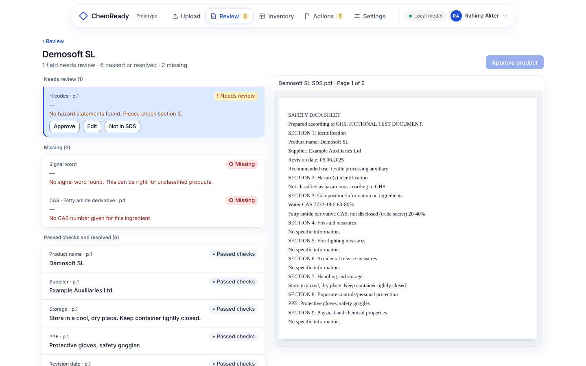

# Frontend (Phase 8)

**Choice: server-rendered pages with Jinja2 and plain HTML forms.**

| Option | Why not, or why |
| --- | --- |
| React / Vue / Svelte | A second language, a build step and a JavaScript toolchain to maintain. Not needed for forms and tables. |
| Streamlit / Gradio | Fast for demos, but cannot follow the approved design (top navigation, split review view, custom states). |
| **Jinja2 + HTML forms** (chosen) | All Python. Each page is a template plus one route in `web.py`. Works on slow connections; no JavaScript needed except two tiny lines (closing toasts, row click). |

## Files

| Path | What |
| --- | --- |
| `src/chemready/app/web.py` | Page routes. Each one reads data through `service.py` / `store.py`, then renders a template. |
| `src/chemready/app/templates/` | One template per screen, plus `app_base.html` (top navigation) and `_macros.html` (icons, status pills) |
| `src/chemready/app/static/app.css` | The approved Phase 1 design (copied from the prototype), plus a few additions for links and `
` menus |

## How things work without JavaScript

- **Menus** (profile, phone menu, edit boxes) use the HTML `
` element: click to open, click to close.
- **Progress**: the Review page refreshes itself every 3 seconds while files are processing.
- **Messages**: after a form is saved, the next page shows a short message ("Saved your edit.").
- **Sign-in redirects**: any app page opened while signed out goes to `/signin?next=<page>`, and back there after signing in. Only same-site paths are allowed (no open redirects).

## Screens

Website `/`, sign in `/signin`, sign up `/signup`, reset `/reset`, Upload `/app/upload`,
Review `/app/review` and `/app/review/{id}`, Inventory `/app/inventory`, Product
`/app/products/{id}`, Actions `/app/actions`, Settings `/app/settings`, Profile `/app/profile`.

